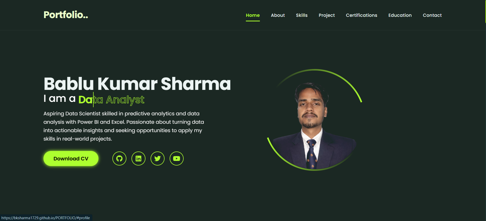
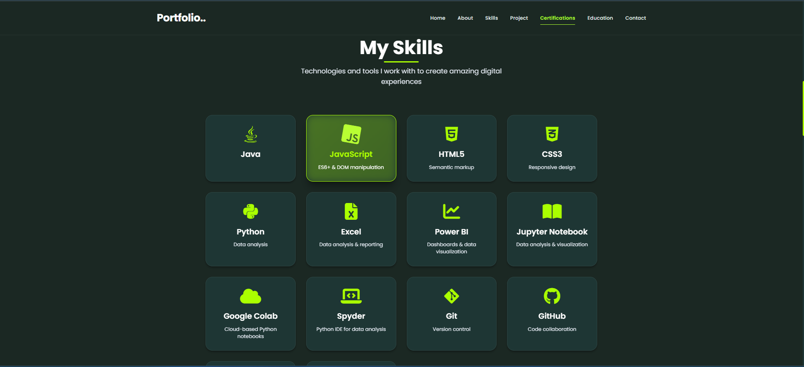
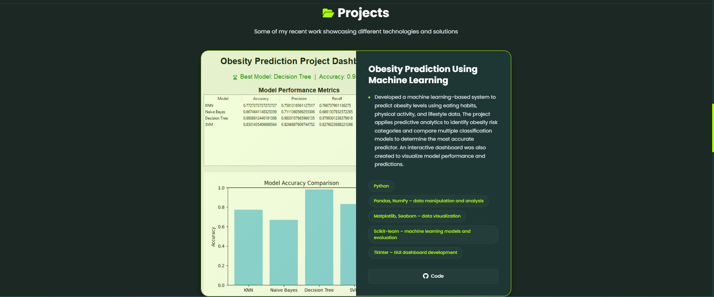
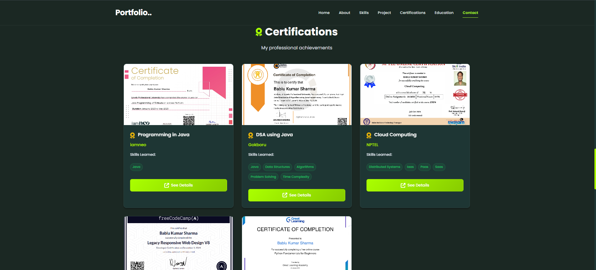

# Portfolio - Bablu Kumar Sharma
<p float="left">
  
  
  
  
</p>
A modern, responsive portfolio website showcasing my work as a **Data Analyst** and **Web Developer**. This project highlights my journey through computer science, my technical skills, certifications, and hands-on projects.

## 🚀 Live Demo
*Link to your hosted portfolio goes here (e.g., GitHub Pages, Vercel, or Netlify)*
https://bksharma1729.github.io/PORTFOLIO/
---

## 🛠️ Technologies Used

### Frontend & Design
- **HTML5:** Semantic structure for optimal SEO and accessibility.
- **CSS3:** Custom styling with CSS Variables, Flexbox, Grid, and smooth animations.
- **FontAwesome:** Scalable vector icons for a professional look.
- **Responsive Design:** Optimized for all screen sizes (Desktop, Tablet, Mobile).

### Data Analysis & Machine Learning Skills
- **Languages:** Python, Java, JavaScript.
- **Tools:** Power BI, Microsoft Excel (Advanced), Jupyter Notebook, Google Colab.
- **Libraries:** Pandas, NumPy, Matplotlib, Seaborn, Scikit-learn.

### Development Tools
- **Version Control:** Git & GitHub.

---

## ✨ Key Features
- **Interactive Hero Section:** Engaging typing effects and profile visualization.
- **Project Gallery:** Showcase of machine learning and software development projects with links to source code.
- **Skill Cards:** Dynamic display of technical competencies.
- **Certifications:** Professional achievements and verified credentials.
- **Dark Mode Support:** Built-in theme support for an ocular-friendly experience.
- **Contact Form:** Integrated form for direct communication.

---

## 📂 Project Structure
```text
Portfolio/
├── assets/         # Images, PDF CV, and other static resources
├── css/            # Modular CSS files (navbar, skills, sections, etc.)
├── about.html      # Detailed about page
├── project.html    # Additional project details
├── skill.html      # Skills breakdown
├── index.html      # Main entry point (Landing Page)
└── README.md       # Project documentation
```


## 💻 Getting Started

To view this portfolio locally:

1. **Clone the repository:**
   ```bash
   git clone https://github.com/bksharma1729/PORTFOLIO.git
   ```
2. **Navigate to the directory:**
   ```bash
   cd My-Portfolio
   ```
3. **Open `index.html`:**
   Simply double-click `index.html` or use a local development server like **Live Server** in VS Code.

---

## 📞 Contact details:-
- **Email:** [babluks2244@gmail.com](mailto:babluks2244@gmail.com)
- **LinkedIn:** [Bablu Kumar Sharma](https://www.linkedin.com/in/bablu-kumar-sharma/)
- **GitHub:** [@bksharma1729](https://github.com/bksharma1729)

*Created by bablu Kumar sharma*
